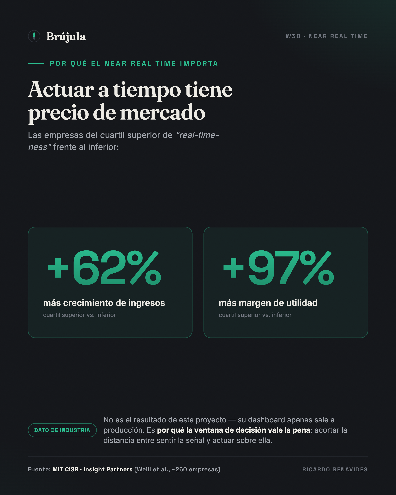

# El near real time que el lakehouse no te iba a dar

### Por qué el reporte operativo de las 8 a.m. no siempre pertenece al data lake

_Draft cerrado — Idea 6 del digest W30 (caso real, anonimizado). Formato:
opinión / autoridad, 3–4 páginas. En edición (`papper-editor` → `papper-humanizer`).
**Confidencialidad:** sin cliente, marcas ni nombres; términos SAP genéricos
(2LIS_11_VAITM, ODP, ADSO, InA) sí citables. **Estado del caso:** dashboard por
liberarse a producción; impacto de negocio aún no medido — la tesis se defiende
por corrección de arquitectura, no por resultados._

---

Cuando llegué al proyecto, la arquitectura ya estaba decidida: llevar los datos a
un lakehouse y reportar en la herramienta de BI corporativa. Es la respuesta por
defecto de 2026, y en el papel cuesta discutirla — democratización, escalabilidad,
todo en un solo lugar. Pero el requisito real la puso a prueba en la primera
reunión. El negocio no quería otro reporte. Quería **actuar durante el día**, no
enterarse al día siguiente.

El equipo de preventa necesitaba ver, en campo y desde el teléfono, cómo iba la
colocación de pedidos **cada media hora**: cuánto volumen llevaban contra el
mismo día del año pasado, qué cobertura de clientes tenían contra su plan de
visitas, y dónde había una brecha contra la meta que exigiera una acción táctica
*antes* de que terminara la jornada.

El estado previo sí tiene números, y vale la pena anclarlos porque son lo único
medido hasta ahora — el punto de partida, no el resultado. La información se
sacaba de un reporte de preventa que se armaba a mano, con **solo tres cortes al
día** y alrededor de **quince horas-persona por semana** de trabajo manual, con
los defectos propios de ese proceso: datos que ya nacían viejos y errores de
captura. Y el punto de comparación "moderno" que ya existía era, irónicamente, un
reporte en **la misma herramienta de BI que la dirección proponía como destino**.
La pregunta de negocio no era "¿cómo me fue ayer?", era "¿alcanzo la meta hoy, y
qué muevo ahora si no?".

Que esa pregunta importe no es una intuición. La investigación de MIT CISR con
Insight Partners sobre *real-time businesses* encontró que las empresas en el
cuartil superior de "real-time-ness" tuvieron **62% más crecimiento de ingresos y
97% más margen de utilidad** que las del cuartil inferior — un premio que viene,
literalmente, de acortar la distancia entre *sentir* una señal y *actuar* sobre
ella. Ese es el dato de la industria, no el mío: sería deshonesto colgarme ese
número. El dashboard apenas está por liberarse a producción y el impacto real
—cuántos pedidos bloqueados se rescatan el mismo día, cuánto se mueve la
cobertura— **está por medirse**. Lo que sí puedo defender hoy, antes de la
primera medición, es la decisión de arquitectura. Y ahí la ruta "moderna" chocó
con una verdad incómoda: **para ese near real time, meter un data lake en medio
no agregaba capacidad. Agregaba latencia.**

## La distinción que casi nadie hace explícita

Conviene ser preciso, porque es fácil caricaturizar el argumento. No estoy
diciendo que un lakehouse no pueda hacer streaming — puede. Lo que digo es más
fino, y es la tesis de esta pieza:

> Cuando el dato transaccional y su lógica de negocio ya viven gobernados dentro
> de SAP, el camino más corto para monitoreo operativo en tiempo casi real es
> traer la query a donde vive la verdad — no mover la verdad para alcanzarla.

Esto tiene nombre en arquitectura: **data gravity**. El principio, acuñado por
Dave McCrory en 2010, dice que mientras más grande y compleja es una masa de
datos, más caro y lento es moverla — así que lo económico es acercar el cómputo
al dato, no el dato al cómputo. No es teoría de pizarrón: la propia guía reciente
de TechTarget sobre eficiencia de data centers lo pone en términos operativos —
"coloca los workloads cerca del dato, **especialmente para aplicaciones
latency-sensitive y en tiempo real**". Y AtScale, en su glosario del tema, es
todavía más directo: la performance de las queries se degrada cuando corren
sobre datos **replicados o ruteados entre plataformas**, la latencia sube, y el
tiempo real se vuelve más difícil de sostener — por eso la práctica madura es
"centralizar el *acceso* y la gobernanza, no el dato".

El requerimiento no era un `SELECT` sobre una tabla plana. Era volumen convertido
a dos unidades por un motor de conversión, comparado contra un día equivalente
exacto del año anterior, restringido por las autorizaciones de la estructura
comercial de cada usuario, y —el detalle que casi rompe cualquier atajo—
**fusionado con pedidos que llegan por una interfaz externa no-SAP** que todavía
no se materializan como entrega. Toda esa lógica ya estaba construida y gobernada
en el data warehouse.

## Lo que cuesta servir eso desde un lake

Para servir eso desde un lake, el trabajo real no es "conectar Databricks". Es
replicar el stream hacia el object store, reconstruir las capas Medallion, y
**volver a implementar la semántica SAP** en una segunda plataforma. Y ese "último
kilómetro" es donde los proyectos se atoran — y no lo dice un vendor de
transformación, lo dice la propia SAP. En un blog técnico de su comunidad sobre
cómo Datasphere preserva el business context, SAP admite sin rodeos que "el
business context —conversiones de moneda, unidades de medida, jerarquías y
configuraciones de seguridad— puede perderse al replicar hacia afuera, por lo que
necesitarás trabajo extra en el sistema destino para reconstruir ese contexto
perdido". Y sobre las autorizaciones es todavía más tajante: "al replicar hacia
afuera, todas las configuraciones de seguridad y los controles de acceso se
pierden, dejando la necesidad ineludible de recrear el control de acceso en el
sistema destino de terceros". Eso —conversión de moneda, jerarquías, seguridad
row-level— es exactamente la lógica que mi requerimiento necesitaba y que ya
vivía gobernada en el warehouse.

Hay algo más, y es la parte que más me gusta del argumento porque no es mía. En un
análisis de junio de 2026 sobre SAP Business Data Cloud —el mundo del *zero-copy*—
un arquitecto lo plantea exactamente como la decisión que tomamos: *"el error que
muchos programas van a cometer es tratar el zero-copy como la arquitectura por
defecto para todo caso. No lo es."* Y da el ejemplo casi textual: **"un workload
de analítica que sirve a usuarios de negocio a través de SAP Analytics Cloud debe
quedarse compartido — semántica gobernada, en tiempo real, sin duplicación"**,
mientras que el mismo dato alimentando un modelo de ML sí se persiste en el lake.
No es SAP vs. Databricks. Es *shared vs. persisted*, y elegir mal el default es lo
que sale caro.

En la práctica, la rama de lake ni se acercaba. En el mejor de los casos —con
todo optimizado— la latencia end-to-end a través del lake caía en **dos a tres
horas**; el plan, de forma realista, la fijó en **dos cargas diarias**. En
cualquiera de los dos escenarios son entre cuatro y seis veces la ventana de
treinta minutos que el negocio necesitaba. El near real time se evaporaba
precisamente en la capa que se suponía iba a modernizarlo.

## El tiempo real no lo pone el destino, lo pone el extractor

La parte contraintuitiva es que el "casi tiempo real" no es un problema de la
herramienta de visualización. Es un problema de **ingeniería de extracción**, y
se resuelve donde nace el dato.

El flujo que sí entregó los treinta minutos es sobrio y aburrido, y por eso
funciona: el DataSource estándar de posiciones de venta (`2LIS_11_VAITM`) alimenta
vía **ODP**, con el extractor LO en modo *queued delta* para no golpear el
performance del sistema transaccional, y con entrega al suscriptor garantizada
*exactly once in order*. Esos micro-lotes
aterrizan en un ADSO con change log activo, cuyas tablas *inbound* y *active*
colapsan los deltas casi al instante, orquestado por **Streaming Process Chains**
en bucle continuo — el reemplazo moderno del viejo *real-time data acquisition*.

Encima de eso, la capa de visualización se conecta en modo **Live**. Y esto no es
opinión de vendor: la documentación oficial de SAP describe la Live Data
Connection en esos mismos términos —análisis **sin replicación de datos**, el dato
confidencial se queda en la red del cliente, se respeta la seguridad implementada
en el sistema origen, se reutiliza la inversión ya construida, el modelado
complejo se hace de forma central y **baja latencia, near real-time**. La
contraparte —la conexión *import*— copia el dato y vive de refrescos programados;
peor aún, obliga a **re-crear las jerarquías y la seguridad row-level dentro de la
herramienta de BI**, que es justo la deuda que queríamos evitar. Elegir Live no
fue una preferencia estética: fue elegir *no* reimplementar la semántica de SAP en
otra plataforma.

El resultado se libera a producción como un dashboard móvil que el preventista
abre en la calle, con el velocímetro de avance vs. el año anterior, la cobertura
contra el visit list y la brecha contra la meta en una sola vista. No es una
arquitectura vistosa. Es la que hace que el número de las 8 a.m. sea defendible a
las 8:01.

## Cuándo el lake sí paga (y por qué separarlos importa)

Nada de esto es un argumento contra el lakehouse. Es un argumento contra usarlo
como respuesta por defecto a una pregunta que no es la suya. El lake paga —y
mucho— cuando el caso es data science, cruce de datos SAP con no-SAP a gran
escala, o machine learning sobre históricos profundos. Ahí la gravedad del dato
juega al revés y mover todo a un motor abierto es exactamente lo correcto.

Y hay una disciplina que va de la mano, para no caer en el error opuesto —el de
sobre-ingenierizar por moda. Como resume bien el análisis de *real-time analytics*
de Business Model Analyst: *"si una decisión pierde valor una vez que el evento
pasa, pertenece a la conversación de tiempo real"* — pero también *"muchos casos
se sirven de sobra con frescura de segundos; perseguir sub-segundo sin una
necesidad que lo justifique es mala asignación de capital"*. El near real time de
treinta minutos no era poco: era **exactamente** la ventana de decisión que la
operación de preventa podía aprovechar. Ni menos, ni un stack de sub-segundo que
nadie iba a usar.

El error de arquitectura, entonces, no es elegir Databricks. Es **no separar dos
problemas distintos**: el reporte operativo near-real-time que el negocio necesita
este trimestre, y la plataforma de analítica avanzada que la organización quiere
construir. Son cadencias distintas, dueños distintos y —esto es lo que se olvida—
caminos técnicos distintos. Cuando los fusionas en un solo proyecto "moderno", la
ambición de plataforma se come el valor operativo que ya podías liberar hoy.

La decisión, al final, fue ejecutar solo la ruta corta. El dashboard está por
liberarse en producción, y con él la *capacidad* de gestionar la colocación de
pedidos de forma casi en tiempo real: actuar sobre la brecha mientras todavía se
puede facturar, en vez de leerla al día siguiente en un tablero perfecto. Cuánto
de esa capacidad se convierte en facturación es la pregunta que las próximas
semanas van a responder — y la mediremos con la misma disciplina con la que se
diseñó. Pero conviene separar dos cosas que se confunden seguido: que una
iniciativa dé o no el número esperado es una hipótesis de negocio; que la
arquitectura sea la correcta para el requisito es una decisión que ya se puede
juzgar. La segunda no depende de la primera. El requisito era treinta minutos sin
duplicar el dato ni reimplementar su semántica, y eso se cumplió.

La lección que me llevo no es sobre SAP ni sobre Databricks. Es esta: antes de
elegir la plataforma, pregunta dónde vive ya la lógica gobernada de tu número. Si
la respuesta es "en el sistema de origen", tu trabajo de arquitecto no es
mudarla. Es acortar la distancia entre esa verdad y la persona que tiene que
actuar sobre ella — y a veces la distancia más corta es la que no pasa por el
lake.

---

## Fuentes

**Evidencia interna (caso, anonimizado):**
- FFD "Sales Order Follow Up" — requerimiento NRT, AS-IS (3 cortes/día, 15 h-persona/sem), dashboard móvil 30 min, preguntas de negocio operativas.
- Definición Funcional de Indicadores (Tabular Pedidos) — KPIs AY/LY (364 días), Meta por forecast, Cobertura vs Visit list, drop size, fusión SAP + interfaz externa.
- Baraja de arquitectura / SLA — rama BW/4HANA+SAC (streaming 15–30 min) vs rama lake (2–3 h en el mejor caso; el plan la fijó en 2 cargas diarias); ODP/`2LIS_11_VAITM`/ADSO `/IMO/D_SD11`/Streaming Process Chains; SAC Live vía InA.

**Refuerzo externo (verificable):**
- MIT CISR / Insight Partners — *Top Performers Are Becoming Real-Time Businesses*: cuartil superior de "real-time-ness" = **+62% crecimiento de ingresos y +97% margen de utilidad**. https://cisr.mit.edu/publication/2024_0801_RealTimeBusiness_WeillvanderBergBirnbaumdePlanta · (versión MIT Sloan Review, ene-2026) https://sloanreview.mit.edu/article/build-business-advantage-with-real-time-decision-making/
- TechTarget — *Data gravity and its role in data center efficiency* (9-jul-2026): coloca el cómputo cerca del dato, sobre todo para cargas real-time. https://www.techtarget.com/searchdatacenter/feature/Data-gravity-and-its-role-in-data-center-efficiency
- AtScale — *What is Data Gravity?* (jun-2026): la performance se degrada con datos replicados/ruteados; centralizar acceso y gobernanza, no el dato. https://www.atscale.com/glossary/data-gravity/
- SAP Learning / help.sap.com — *Connection Types / Live vs Import in SAC*: Live = sin replicación, dato en la red del cliente, seguridad heredada, "near real-time"; Import = copia + refresco programado + re-crear jerarquías y seguridad. https://learning.sap.com/courses/creating-data-connections-for-on-premise-data-sources-in-sap-analytics-cloud/introducing-connection-types-in-sap-analytics-cloud
- **SAP** (blog técnico de su comunidad — MajoMartinez, dic-2025) — *Datasphere: maintaining the business context & considerations*: la propia SAP admite que el business context (conversión de moneda, UoM, jerarquías, seguridad/autorizaciones) "se pierde al replicar hacia afuera" y hay que reconstruirlo en el sistema destino de terceros. https://community.sap.com/t5/technology-blog-posts-by-sap/datasphere-the-solution-to-maintain-the-business-context-amp-considerations/ba-p/13972913
- *Beyond Zero Copy: What SAP Business Data Cloud Actually Means* (jun-2026): el zero-copy NO es el default para todo; el workload que sirve a usuarios vía SAC "debe quedarse compartido — semántica gobernada, real-time, sin duplicación". https://www.linkedin.com/pulse/beyond-zero-copy-what-sap-business-data-cloud-means-ai-sengupta-bzzsc
- cirqlone — *The Hidden Cost of Losing SAP Context* (ago-2025): extraer SAP a un lake genérico elimina la semántica; "si la IA dice una cosa y SAP otra, ¿a cuál le crees?". https://cirqlone.com/hidden-cost-of-losing-sap-context/
- Business Model Analyst — *Real Time Analytics: A Strategic Guide for 2026*: define la latencia por necesidad de negocio; near-real-time (segundos/minutos) basta en muchos casos; no sobre-construir por vanidad. https://businessmodelanalyst.com/real-time-analytics/
