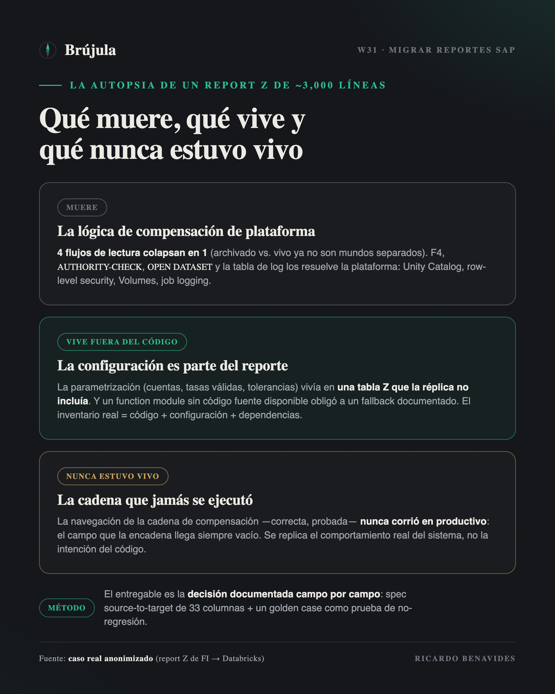
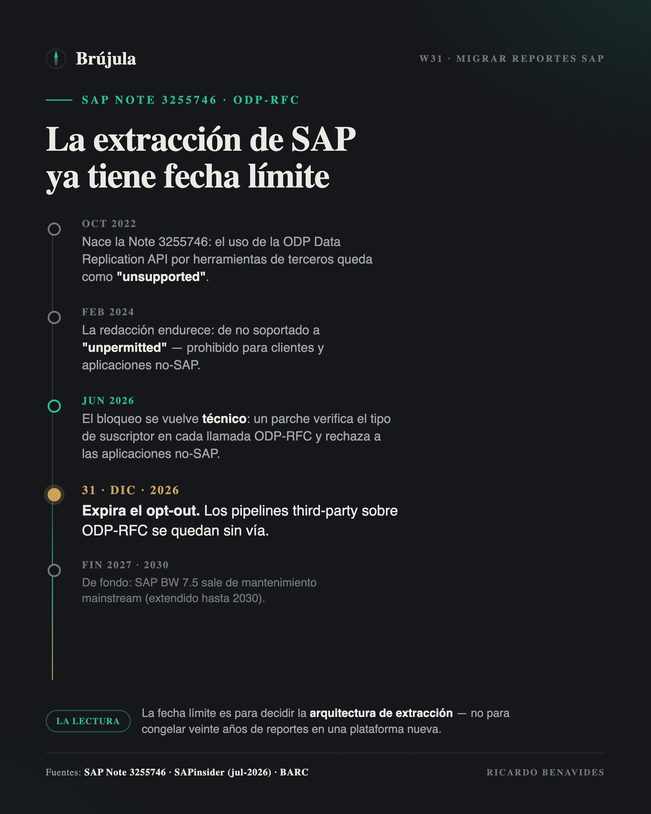

# Migrar un reporte Z no es traducir ABAP: es una autopsia

### Lo que un report de casi 3,000 líneas me enseñó sobre llevar SAP al lakehouse

_Draft editado (`papper-editor`, fase 2) — Idea 1 del digest W31 (caso real,
anonimizado). Formato: deep-dive / autoridad, 3–4 páginas. Pendiente: pase de
voz (`papper-humanizer`) → EN.
**Confidencialidad:** sin cliente, sociedad, marcas ni nombres de objetos Z;
tablas y transacciones SAP estándar (BKPF, KONP, T007A, MAKT, SARA) sí citables.
**Estado del caso:** ya NO es POC — el modelo está generado y actualmente
cuadra los ejercicios 2025 y 2026 contra el sistema origen._

---

Hay una promesa que se repite en cada propuesta de modernización: "migramos tus
reportes SAP al lakehouse". Suena a traducción — ABAP entra, SQL o PySpark sale,
y el número que el negocio ya conoce aparece ahora en un dashboard. Este año la
decisión dejó de ser opcional para muchos: SAP BW 7.5 sale de mantenimiento
mainstream a fines de 2027, y desde junio de 2026 SAP bloquea técnicamente la
extracción ODP-RFC de aplicaciones no-SAP — con un opt-out que expira el 31 de
diciembre. Miles de organizaciones están decidiendo *este* año qué se lleva al
lakehouse y por dónde.

Yo acabo de pasar por eso con un reporte concreto: un report Z de FI, productivo
desde hace años, que produce el facturado mensual con su IVA por documento —
comprobante fiscal incluido, cliente, tasas, estatus de compensación. Casi tres
mil líneas de ABAP, la enorme mayoría en FORMs. El destino: una tabla Delta en
Databricks, consumida desde Power BI. Y no se quedó en piloto: **el modelo ya
está generado y hoy cuadra los ejercicios 2025 y 2026** contra el sistema
origen.

La lección más honesta que puedo compartir es esta: **migrar ese reporte no fue
traducirlo. Fue hacerle una autopsia.** Y lo que encontramos adentro cambia la
manera en que conviene planear cualquier migración de reportes SAP — estándar o
Z — hacia Databricks, Snowflake o el destino que sea.

> El entregable de una migración de reporte no es "el mismo reporte en otra
> plataforma". Es la decisión explícita, documentada, de qué lógica vive, qué
> lógica muere y qué lógica nunca estuvo viva.

## Dead code walking: la lógica que existe por limitaciones que ya no tienes

Lo primero que apareció al abrir el reporte: **cuatro flujos de lectura
distintos** — documentos archivados contra documentos vivos, cruzados con
facturación contra no-facturación. Cuatro caminos de código, cada uno con sus
FORMs, sus estructuras intermedias y sus casos especiales.

¿Por qué existen? Porque en el sistema origen los datos archivados y los vivos
se leen por mecanismos diferentes, y el autor original no tuvo más remedio que
tratarlos como mundos separados. En el lakehouse esa limitación no existe: una
vez que ambos conjuntos aterrizan en tablas, la unión es un `UNION` y los cuatro
flujos **colapsan en uno** (más un flujo aparte para movimientos
extraordinarios, que sí es una distinción de negocio real). Media docena de
FORMs desaparecieron, no porque los optimizamos, sino porque el problema que
resolvían ya no existe.

Y no fueron los únicos funerales. La ayuda de búsqueda F4 no tiene equivalente
ni falta que hace. El `AUTHORITY-CHECK` por sociedad se vuelve gobierno de
plataforma: Unity Catalog y seguridad row-level, declarada una vez, no
programada en cada reporte. El `OPEN DATASET` que escribía un CSV al servidor de
aplicación se vuelve un write a un Volume. La tabla Z de log de ejecuciones se
vuelve el logging del job. Nada de eso se migra: **se deja morir con
dignidad, y se levanta el acta de defunción.**

Este es el primer hallazgo de método: antes de estimar una migración de
reportes, separa la lógica de negocio de la **lógica de compensación** — el
código que solo existe para esquivar limitaciones de la plataforma vieja. En
nuestro caso, una fracción muy grande de esas tres mil líneas era compensación
pura. Quien cotiza la migración por líneas de código está cotizando la mudanza
de muebles que van directo a la basura.

## La lógica que no está en el código

La sorpresa opuesta fue más incómoda: una parte central del comportamiento del
reporte **no estaba en el ABAP**. Estaba en filas.

El reporte lee su parametrización de una tabla Z de configuración: qué cuentas
de IVA trasladado y retenido considerar, qué tasas son válidas, qué clases de
documento entran, niveles de compensación, tolerancias. Todo eso son datos, no
código — y la réplica hacia el lakehouse **no incluía esa tabla**. El programa
podía traducirse completo y aun así no calcular nada correcto, porque su cerebro
estaba en otra parte. La solución de corto plazo fue exportar la configuración y
embeberla como fallback versionado en el pipeline; la de largo plazo es tratarla
como lo que es: una tabla maestra más que debe replicarse y gobernarse.

Peor todavía: el reporte llama un function module Z que deriva la clave de
producto/servicio para el comprobante fiscal — y su código fuente **ya no se
pudo obtener**. No hay traducción posible de un programa que nadie puede leer.
La decisión fue un fallback documentado (la descripción de material de `MAKT`
como aproximación) con el hueco marcado, visible, esperando la definición
funcional. Otra rutina — la que determina el porcentaje de impuesto — se
reconstruyó desde las tablas estándar (`KONP` con `T007A`), que es de donde el
dato siempre debió salir.

Si diriges una migración, este es el segundo hallazgo: **el inventario de un
reporte no es su código; es su código más su configuración más sus
dependencias.** Tablas Z de parametrización, function modules compartidos,
variantes de ejecución. El código te lo da un extractor; el inventario completo
solo te lo da la autopsia.

## Replicar el comportamiento, no la intención

El hallazgo que más me hizo pensar fue uno que parecía menor. El reporte incluye
lógica para navegar la cadena de compensación de un documento — seguir el rastro
de pagos y compensaciones parciales, iterativamente, hasta cerrar el ciclo. En
Spark eso serían self-joins recursivos: caros y delicados. Nos preparamos para
la batalla.

Y entonces miramos los datos productivos: el campo que encadena la navegación
llegaba **siempre vacío**. Por cómo está configurado el sistema, esa lógica
—correcta, bien escrita, probada— **nunca se había ejecutado**. El reporte
llevaba años produciendo cifras válidas sin rastrear ninguna cadena.

Ahí hay una decisión de arquitectura disfrazada de detalle: ¿replicas lo que el
código *intenta* hacer, o lo que el sistema *realmente* hace? Nosotros elegimos
replicar el comportamiento real y dejar la divergencia asentada por escrito.
Migrar la intención
habría sido construir —y pagar, y mantener— una pieza de complejidad que
producción jamás usó. Este patrón se repite en versiones menores por todo el
código: el operador `CP` de un rango SAP que en la práctica es un `LIKE`; las
estructuras de rangos SIGN/OPTION/LOW/HIGH que no tienen equivalente natural en
SQL y que casi siempre se usan como un simple `IN` o un `BETWEEN`. Cada una
exige la misma pregunta: ¿fidelidad al código, o fidelidad al sistema?

## La spec es el contrato, el golden case es el seguro

Nada de lo anterior se sostiene sin método, y aquí conecto con algo que escribí
hace unas semanas: el diseño es la migración. Para este reporte, el diseño tomó
la forma de una **especificación source-to-target de 33 columnas**: por cada
campo de salida, su origen exacto (tabla, campo, transformación, regla de
negocio, comportamiento ante nulos), decidido *antes* de escribir el pipeline.
Cada funeral del que hablé arriba está asentado ahí — qué se replica, qué se
simplifica, qué muere y por qué.

Y la implementación se protegió con una disciplina que le recomiendo a cualquier
equipo: **desarrollo guiado por pruebas con un golden case**. Un caso real,
verificado a mano contra el sistema origen, con su resultado esperado fijado
como prueba de no-regresión. Cada refactor del pipeline corre contra ese número.
Si algún día no cuadra, el pipeline no pasa. En dominio fiscal esto no es
perfeccionismo: es la diferencia entre "el job corrió en verde" y "el número es
defendible frente a una auditoría".

Protiviti estimó este año que salir de BW hacia una plataforma no-SAP demanda
**tres a cuatro veces más esfuerzo** que quedarse en las rutas SAP — y señala
exactamente dónde: preservar la lógica de negocio compleja. Mi experiencia dice
que esa estimación es creíble, pero con un matiz importante: el esfuerzo no se
va en traducir lógica. Se va en **descubrir cuál lógica es de negocio, cuál es
compensación de plataforma y cuál está en configuración** — la autopsia. La
traducción, con la spec cerrada, es la parte rápida.

Un dato más, por si piensas que exagero con lo de la autopsia: **la guía
oficial no existe**. Los dueños de plataforma —Databricks, Snowflake,
Microsoft, AWS, Google— documentan con detalle la capa de datos (extracción,
CDC, zero-copy), pero ninguno publica cómo traducir la lógica de un reporte Z a
SQL o PySpark. Lo más cercano, el Cortex Framework de Google, sustituye el
reporting estándar con views predefinidas — y deja lo custom para reescritura
manual. El único vendor que hoy documenta migración de lógica ABAP es SAP
mismo: una serie de 2026 sobre migración asistida por IA de BW 7.5 a Business
Data Cloud, que cubre solo rutinas y transformaciones de BW, y solo hacia su
propio destino. Si vas hacia un lakehouse de terceros, la autopsia no viene con
manual: **el método lo pones tú.**

## IEPS por material: cuando la granularidad decide la verdad

El mismo proyecto incluía un reto mayor que migrar lo existente: construir un
desglose que SAP no daba de fábrica — **el IEPS por material**. La verdad
fiscal del IEPS vive en `BSET` (importe y base por línea de impuesto), pero
`BSET` **no lleva material**. Y llegar al material no era un lujo analítico:
el IEPS no es una tasa única — en bebidas alcohólicas la tasa cambia con la
graduación (26.5%, 30% o 53%), así que una factura mixta puede mezclar varias
tasas en un mismo documento. **Sin el nivel de detalle por material no hay
forma de atribuir a cada línea su tasa y su base correctas.** El detalle por
SKU hay que reconstruirlo desde las posiciones contables y de factura,
atribuyendo el impuesto a cada material y cuadrando la suma de vuelta contra
`BSET`. Cuando lo probamos contra un documento real, la reconstrucción
**cuadró al centavo**: base idéntica y una diferencia de un centavo por
redondeo. El desglose que parecía imposible — "la tabla fiscal no trae
material" — era perfectamente alcanzable con la granularidad correcta.

Y ahí está la palabra clave: **la granularidad**. La primera versión de la
consulta trabajaba a granularidad de documento, eligiendo un "material
representativo" por factura
(un `min(MATNR)` con un filtro de grupo de material). Las facturas de un solo
producto pasaban perfecto; las facturas mixtas, con treinta o cuarenta
materiales, **se caían completas del universo** cuando su material
representativo no pasaba el filtro. Resultado: cerca del **57% del importe real
era invisible** — sin un solo error de cálculo. La lógica era correcta; la
unidad de análisis estaba mal elegida.

El error se detectó de la manera aburrida: exportar las tablas de un documento
real (`BKPF`, `BSEG`, `BSET`) y sumar a mano. De ahí las dos prácticas que me
llevo para cualquier cálculo fiscal en el lakehouse: **control totals por
documento contra la fuente fiscal antes de agregar nada**, y la granularidad
tratada como decisión de diseño explícita en la spec — no como detalle de
implementación. Un desglose fiscal que cuadra "casi" no es un éxito: en este
dominio se cuadra al centavo, o no se cuadró.

## El mejor reporte que migras es el que matas

Queda la pregunta de portafolio, y es donde esto escala de un reporte a una
estrategia. Si un solo report Z exigió este nivel de análisis, ¿qué haces con
los cientos que acumula cualquier instalación con veinte años de historia?

La respuesta seria no es "migrarlos todos" ni "reescribirlos todos": es medir
uso antes de tocar nada. BW y el stack ABAP llevan estadísticas técnicas de
ejecución; la práctica madura es arrancar la migración con ese inventario — qué se ejecuta, qué está huérfano, qué se
duplica — y enterrar sin culpa lo que lleva años sin correr. Cada reporte que
matas es una autopsia que no pagas. Y lo que sí migra no debería migrar como
reporte, sino como **data product**: el reporte es una vista sobre una verdad de
negocio; migra la verdad una vez y las vistas se vuelven baratas.

El contexto de 2026 vuelve esta disciplina urgente. Con la puerta ODP-RFC
cerrándose en diciembre y el fin de mantenimiento de BW en el horizonte, la
tentación es correr a mover todo lo que hay. Es la decisión exactamente
equivocada: la fecha límite es para decidir la *arquitectura de extracción*, no
para congelar veinte años de reportes en una plataforma nueva. La deuda técnica
no se paga mudándola de casa.

La lección que me llevo cabe en una frase: un reporte legacy no es un
requerimiento, es un **testigo** — testifica lo que el negocio necesitó alguna
vez, con las limitaciones de la plataforma donde nació. El trabajo del
arquitecto no es traducir al testigo palabra por palabra. Es interrogarlo,
quedarse con la verdad, y dejar que el resto descanse en paz.

---

## Fuentes

**Evidencia interna (caso, anonimizado):**
- Report Z de FI (~3,000 líneas; facturado + IVA por documento con comprobante
  fiscal, estatus de compensación y bandera de archivado) → tabla Delta en
  Databricks consumida en Power BI. Modelo generado y en operación, cuadrando
  los ejercicios 2025 y 2026. Documentación técnica de la extracción del
  código, spec de emulación source-to-target de 33 columnas, módulo PySpark con
  suite de pruebas (TDD, golden case de no-regresión).
- Hallazgos de la autopsia: 4 flujos → 1 (+1 extraordinarios); parametrización
  en tabla Z de configuración no replicada (export + fallback versionado); FM Z
  sin código fuente disponible (fallback documentado vía `MAKT`); porcentaje de
  impuesto reconstruido desde `KONP` ⋈ `T007A`; navegación de cadena de
  compensación nunca ejecutada en productivo (campo de encadenamiento vacío) —
  se replicó el comportamiento real; rangos SIGN/OPTION/LOW/HIGH y patrón `CP`
  → equivalentes SQL simplificados y documentados.
- Cálculo de IEPS por material: reconstrucción del impuesto por SKU desde las
  posiciones (BSET no lleva material) validada contra `BSET` al centavo (dif.
  $0.01 por redondeo); el material era obligado porque el IEPS maneja tasas
  distintas por graduación (26.5/30/53%); hallazgo de granularidad — consulta a
  granularidad de documento con
  material representativo (`min(MATNR)` + filtro de grupo) dejaba invisible
  ~57% del importe real en facturas multi-SKU, sin error de cálculo; detectado
  exportando BKPF/BSEG/BSET de un documento real y sumando a mano.

**Refuerzo externo (verificable):**
- Protiviti — *Moving Beyond SAP BW: The Real Options Analytics Leaders Are
  Weighing in 2026* (Jonathan Haun, 21-abr-2026): cinco rutas de salida de BW;
  replatforming a plataforma no-SAP ≈ **3–4× el esfuerzo** de las rutas SAP; el
  obstáculo principal es preservar la lógica de negocio compleja.
  https://tcblog.protiviti.com/2026/04/21/moving-beyond-sap-bw-the-real-options-analytics-leaders-are-weighing-in-2026/
- SAPinsider — *SAP Note 3255746: la deadline ODP-RFC de 2026* (2-jul-2026):
  cronología de la restricción; parche de jun-2026 que bloquea técnicamente
  ODP-RFC para aplicaciones no-SAP; opt-out hasta 2026-12-31; herramienta de
  auto-diagnóstico (Note 3439624).
  https://sapinsider.org/blogs/sap-note-3255746-odp-rfc-deadline-2026/
- Databricks (blog técnico de su comunidad, Jerome Ivain, oct-2024) —
  *Navigating the SAP Data Ocean: Demystifying SAP Data Extraction*: mapa de
  vías de extracción compliant; el propio Databricks recomienda Replication
  Flows y admite el trade-off entre compliance y eficiencia.
  https://community.databricks.com/t5/technical-blog/navigating-the-sap-data-ocean-demystifying-sap-data-extraction/ba-p/94617
- BARC — *End of Maintenance for SAP BW: What's Next?* (Larissa Baier): BW 7.5
  mainstream hasta fines de 2027, extendido 2030; BW/4HANA hasta 2040.
  https://barc.com/end-of-maintenance-sap-bw/
- SAP Community — *The SAP BW Migration Decision: Your Real Options in 2026*
  (miembro, 2026): el debate de rutas dentro de la comunidad SAP.
  https://community.sap.com/t5/technology-blog-posts-by-members/the-sap-bw-migration-decision-your-real-options-in-2026/ba-p/14359306
- SAP (blog oficial "by SAP", abr-2026) — *Blog 4 — AI-assisted migration of
  Business Logic from BW 7.5 to BDC*: lo único oficial sobre migrar lógica
  ABAP custom — solo rutinas/transformaciones BW y solo hacia BDC/Datasphere.
  https://community.sap.com/t5/technology-blog-posts-by-sap/blog-4-beyond-data-warehousing-ai-assisted-migration-of-business-logic-from/ba-p/14365536
- Databricks — *Databricks Migration Strategy: Lessons Learned* (oct-2024):
  migración de EDW genérica con "code translation" vía partners; sin mención
  de ABAP/SAP en la capa de lógica.
  https://www.databricks.com/blog/databricks-migration-strategy-lessons-learned
- Google Cloud — *Cortex Framework: Integration with SAP*: views de reporting
  predefinidas sobre ECC/S4 en BigQuery; lo custom (reportes Z) se reescribe a
  mano. https://docs.cloud.google.com/cortex/docs/operational-sap
